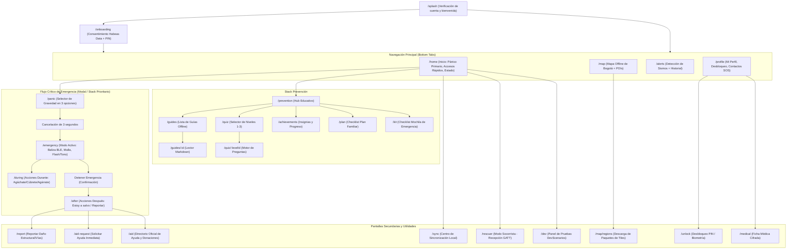

# Árbol de Navegación – EarthQuakeTracker (S-E2 / SA-002)

## 1. Principio Rector de Navegación
- **Flujo de Pánico en ≤ 2 toques:** Accesible de forma global mediante botón persistente en la cabecera / barra principal o pestaña Inicio.
- **Funcionamiento 100 % Offline:** Ninguna transición de pantalla queda bloqueada esperando respuesta de red.
- **Navegador:** Implementado con React Navigation (`@react-navigation/native`, `@react-navigation/bottom-tabs`, `@react-navigation/native-stack`).

## 2. Diagrama de Navegación

## 3. Matriz de Rutas y Accesibilidad

| Ruta | Tipo | Requisitos de Acceso | Servicio Contrato Principal |
| --- | --- | --- | --- |
| `/splash` | Stack | Ninguno | `SessionService.hasAccount()` |
| `/onboarding` | Stack | Solo en primera apertura | `SessionService.createLocalAccount()` |
| `/home` | Tab | Público | `EmergencyService`, `SyncService`, `PowerService` |
| `/map` | Tab | Público (Bogotá offline) | `PoiService`, `TileService` |
| `/alerts` | Tab | Público | `AlertsService`, `SensorService` |
| `/profile` | Tab | Público (detalles sensibles protegidos) | `SessionService`, `MedicalProfileService` |
| `/panic` | Modal prioritario | Público (≤ 2 toques desde `/home`) | `EmergencyService.requestPanic()`, `selectSeverity()` |
| `/emergency` | Fullscreen activo | Estado `phase === 'ACTIVE'` | `EmergencyService`, `MeshService`, `SignalingController` |
| `/during` | Stack / Overlay | Durante la sacudida | `EmergencyService`, `SensorService` |
| `/after` | Stack | Post-emergencia | `EmergencyService.markSafe()`, `ReportService` |
| `/medical` | Stack seguro | Requiere sesión desbloqueada (`isUnlocked`) | `MedicalProfileService` |
| `/unlock` | Modal de seguridad | PIN de 6 dígitos o huella/FaceID | `SessionService.unlock()` |
| `/guides` | Stack | Público | `ContentService.listGuides()` |
| `/guides/:id` | Stack | Público | `ContentService.getGuideMarkdown()` |
| `/quiz` | Stack | Público | `ContentService.getQuizBank()`, `ProgressRepository` |
| `/quiz/:levelId` | Stack | Nivel previo ≥ 70 % | `ProgressRepository.saveAttempt()` |
| `/achievements` | Stack | Público | `ProgressRepository.listBadges()` |
| `/aid` | Stack | Solo canales oficiales | `AidDirectoryService` |
| `/sync` | Stack / Sheet | Indicador en cabecera | `SyncService.syncNow()` |
| `/rescuer` | Stack autenticado | Código oficial de socorrista | `RescuerService.enable()` |
| `/dev` | Oculto (Debug) | Solo compilación desarrollo / mock | `DevScenarioController` |
